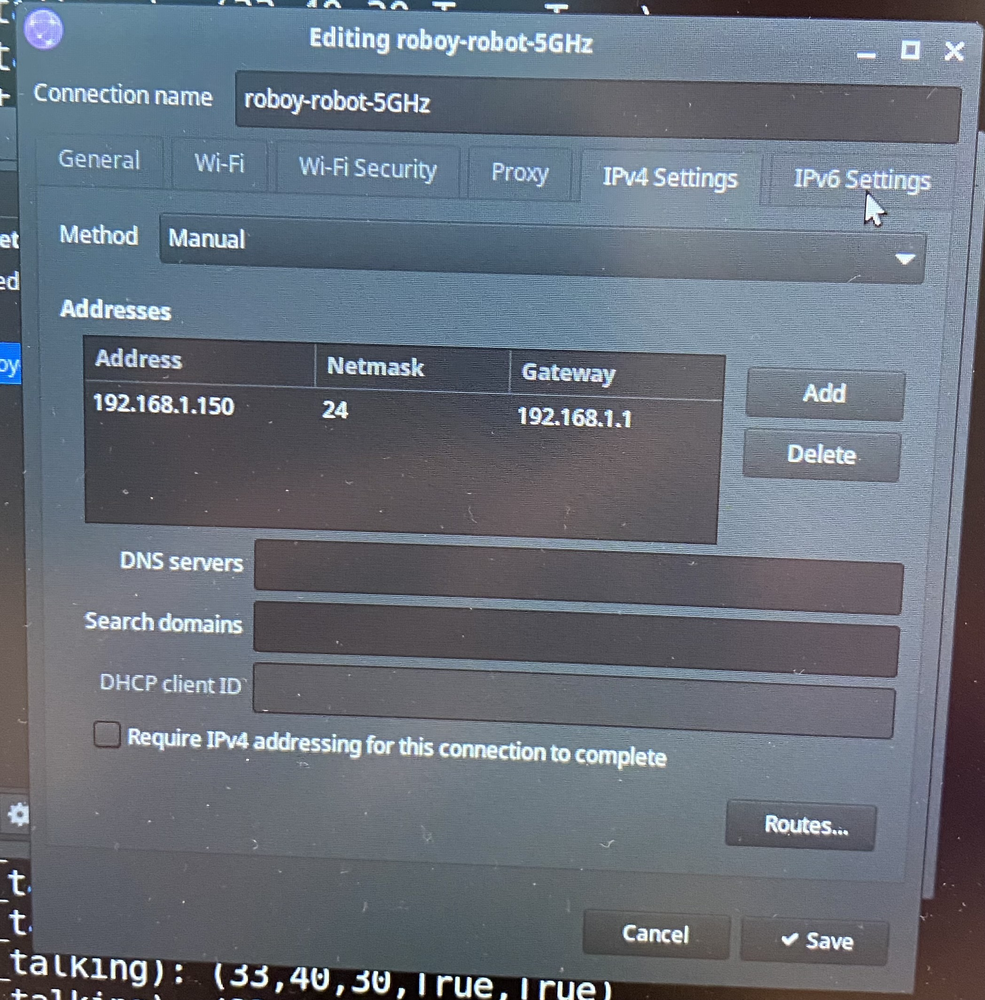

# RollbodyUnityFace

Rollbody's facial expressions are animated in Unity. Based on [RoboyUnityFace](https://github.com/Roboy/RoboyUnityFace) (`roboy3.0-dev` branch).


## Installation

Use version 2021.3.8f1 (LTS) of the Unity Editor to avoid compatibility problems. Clone the repo and open it as a project in Unity. 

You can also install the release `.apk` file to the Android tablet directly, e.g. with: `adb install RollbodyFaceSim.apk`.

## Connection for Voice and Head Movements

The face simulation was deployed on an Android tablet to animate Rollbody's head. The lip movement in the Unity scene is according to the waveform of incoming microphone sound (read more about this in the **LipSync** section). You can input microphone sound to the tablet by connecting it to a Jetson Nano (audio cable) and configuring the tablet as a sound output device in Ubuntu on the Jetson Nano.

### TCP Connection

As using ROS 2 is not possible in a Unity app on an Android device, a TCP connection serves as a simple workaround for setting the head pose in the Unity scene according to the head pose of the operator. You can find a TCP client script in `RollbodyUnityFace/Assets/TCPHeadClient.cs`, which is attached to a game object in the Unity scene and tries to connect on startup. It has automatic reconnection built-in, but will not work if it is started before the TCP server is started.

For testing purposes, there is a C# test server in `RollbodyUnityFace/Assets/TCPTestServer.cs` and a Python version in `RollbodyUnityFace/TCP_test_server.py` (this one can easily be deployed on the Jetson Nano). Remember that the hostname and port of client and server must match. The respective lines for checking/changing this are easy to find in the afformentioned scripts.

If you want to deploy `RollbodyUnityFace/TCP_text_server.py` on the Jetson Nano, you must make sure that the Android tablet and the Jetson Nano are in the same (WiFi) network. Also, you need to set a static IP on the Jetson Nano. This is the network configuration used with Rollbody:



## Project Structure

All existing animations are stored in `RollbodyUnityFace/Assets/Animations`. Corresponding material (pictures to show them on the face, e.g. a moustache or sunglasses) are stored in `RollbodyUnityFace/Assets/FaceComponents`.

Animations can get triggered from the dialog system with this code snippet.  

```
if (emotion == "tongue")
            anim.SetTrigger("tongue_out");
```
In addition to that, animations can be triggered manually via the keyboard by pressing buttons: 

```
if (Input.GetKeyDown(KeyCode.Q))
            SetEmotion("happy");
```

The following emotions can be triggered via the keyboard:

| Key | Emotion |
|---|---|
| S | Shy |
| E | Money |
| K | Kiss |
| L | lookleft |
| R | lookright |
| B | blink |
| W | smileblink |
| D | tongue out |
| Q | happy |
| Y | lucky |
| H | Hearts |
| N | pissed | 
| A | angry |
| X | irritated |
| V | hypno eyes |
| U | coloured hypno eyes |
| I | rolling eyes | 
| Z | surprised |
| P | pirate (boolean, key needs to be pressed again to stop animation) |
| C | crying Roboy (boolean, key needs to be pressed again to stop animation) |
| G | glasses (boolean, key needs to be pressed again to stop animation) |
| M | moustache (boolean, key needs to be pressed again to stop animation) |
| F | pink, sunglasses (boolean, key needs to be pressed again to stop animation) |

These animations were created/added by the original authors of the project and/or students of Roboy Student Team SS18.

## How to get started? How to get animations running in Unity? 

Open the project in Unity and click on the `RollbodyFaceSim` scene. The scene will open.

Having started `RollbodyFaceSim` in Unity,there is a Project window. For viewing all existing animations, first click on "face" in the Project Window. In a second step, open the "Animator" window. For viewing existing animations, press the play button on the top and trigger the animations in the "Animator" (Parameters) window. All animations can also be triggered via the keyboard. The shortcuts for the animations are in the upper part ("Prerequesites"). New animations can be added via the Animation window (if the animation or the Animator window is not shown, you can open it by clicking on the "Window" button at the bar on the top of Unity program).

For all current and new animations, there is the Inspector on the right hand side, which has different functions for changing or modifying existing and new animations.

If you create a new animation, a transition from idle state to the animation state is necessary to get the animations running. This can be done in the Animator window. Transitions from the animation state back to the idle state are also necessary to stop the animations.

## LipSync

All SALSA LipSync settings can be changed in the Game Object (Face > Mouth2.0) components.

### Audio Input

The audio file can be changed in the Audio Source component. Go to `SALSA > Settings > Dynamics` and change Min/Max in the "Linear Scaled Cutoff" until you get a satisfying result.

### Microphone Input

To controll the Mouth with your voice, connect SALSA to your microphone. To do so, activate the "Salsa Mic Pointer Sync (Script)" and "SalsaMicInput" component. In the "SalsaMicInput" make sure to check "Override Rate" and "Link with SALSA", this will override some Settings in the "SALSA" component (i.e activate "Using Microphone").

## How to use it with ROS 2 (tested, but not implemented right now)
The asset [Ros2ForUnity_UbuntuGalactic.unitypackage](https://github.com/RobotecAI/ros2-for-unity/releases) from [ROS2-for-Unity](https://github.com/RobotecAI/ros2cs) provides an implementation of a ROS2 node in C# that can be added to the scene. You need [ROS 2 Galactic](https://docs.ros.org/en/galactic/index.html) installed on your machine. This was tested with Ubuntu 20.04. You then need to run Unity from terminal using:

```
source /opt/ros/galactic/setup.bash
.$HOME/Unity/Hub/Editor/2021.3.8f1/Editor/Unity -projectPath path/to/RollbodyUnityFace
```
